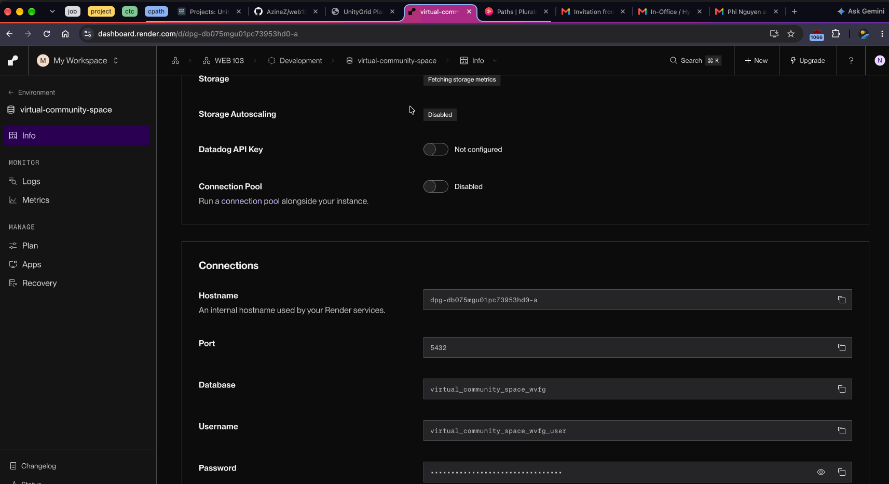

# WEB103 Project 3 - UnityGrid Plaza

Submitted by: **Phi Nguyen**

About this web app: **A virtual community space where users select retro gaming convention locations from an interactive map and view the events scheduled at each location.**

Time spent: 6 hours

## Required Features

The following **required** functionality is completed:

-  [x] **The web app uses React to display data from the API**
-  [x] **The web app is connected to a PostgreSQL database, with an appropriately structured Events table**
   -  [x] **NOTE: The walkthrough added to the README includes a view of the Render dashboard demonstrating that the Postgres database is available**
   -  [x] **NOTE: The walkthrough added to the README demonstrates the table contents using `SELECT * FROM tablename;`**
-  [x] **The web app displays a title.**
-  [x] **The website includes a visual interface that allows users to select a location they would like to view.**
-  [x] **Each location has a detail page with its own unique URL.**
-  [x] **Clicking a location navigates to its corresponding detail page and displays a list of all events from the `events` table associated with that location.**

The following **optional** features are implemented:

-  [ ] An additional page shows all possible events
   -  [ ] Users can sort or filter events by location.
-  [ ] Events display a countdown showing the time remaining before that event
   -  [ ] Events appear with different formatting when the event has passed.

The following **additional** features are implemented:

-  [x] Event dates and times are formatted for readability.
-  [x] Location pages include loading and error states.

## Video Walkthrough

Made with Licecap

## Notes

One challenge I faced was passing the dynamic location ID from React’s /locations/:id route through the Express API to PostgreSQL. I had to read the ID with useParams(), validate it in the controller, and then use it in a parameterized query so only events with the matching location_id were returned.

## License

Copyright 2026 Phi Nguyen

Licensed under the Apache License, Version 2.0 (the "License"); you may not use this file except in compliance with the License. You may obtain a copy of the License at:

<https://www.apache.org/licenses/LICENSE-2.0>

Unless required by applicable law or agreed to in writing, software distributed under the License is distributed on an "AS IS" BASIS, WITHOUT WARRANTIES OR CONDITIONS OF ANY KIND, either express or implied. See the License for the specific language governing permissions and limitations under the License.
